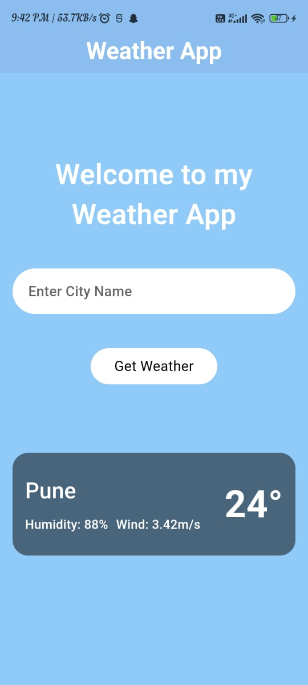
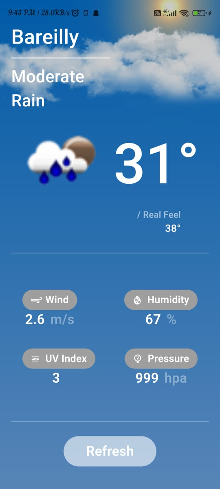

# Flutter Weather App

Welcome to the Flutter Weather App! This application allows users to search for weather details of any city and view recently searched cities' weather information.

## Features

- **Weather Details for Searched City:** Enter the name of a city to get current weather details such as temperature, humidity, wind speed, and weather conditions.
- **Recently Searched Cities:** The app keeps track of the most recent cities searched and displays their weather details.

## Technologies Used

- **Flutter:** A UI toolkit for crafting beautiful, natively compiled applications for mobile, web, and desktop from a single codebase.
- **Dart:** A client-optimized programming language for fast apps on any platform.
- **State Management:** Managed using the `provider` package, which makes it easier to separate UI from business logic.
- **API:** Weather data is fetched from the [OpenWeatherMap API](https://openweathermap.org/api).

## Dependencies Used
- **cupertino_icons:**
    - This is an asset repo containing the default set of icon assets used by Flutter's Cupertino widgets.
    - Check out its usage at https://pub.dev/packages/cupertino_icons.
- **shared_preferences:**
    - A Flutter plugin for reading and writing simple key-value pairs. Wraps NSUserDefaults on iOS and SharedPreferences on Android.
    - Check out its usage at https://pub.dev/packages/shared_preferences.
- **flutter_weather_bg_null_safety :**
    - A Flutter plugin that provide a variety of weather background animation effects, covering 15 weather types, including sunny,rain,snow...
    - Check out its usage at https://pub.dev/packages/flutter_weather_bg_null_safety.
- **http :**
    - This package contains a set of high-level functions and classes that make it easy to consume HTTP resources. It's multi-platform (mobile, desktop, and browser) and supports multiple implementations.
    - Check out its usage at https://pub.dev/packages/http.
- **provider :**
    - The Provider is a state management solution that extends and simplifies Inherited Widgets. It is a versatile and powerful state manager that allows you to deliver data to any widget in your app.
    - Check out its usage at https://pub.dev/packages/provider.


## Architecture: MVVM

The Flutter Weather App is built using the MVVM (Model-View-ViewModel) architecture, which separates the development of the graphical user interface from the business logic or back-end logic (the data model).

- **Model:** This layer represents the data and the business logic of the application. In our case, it includes the data models for the weather information and the logic to fetch data from the OpenWeatherMap API.
- **View:** This layer represents the UI of the application. It consists of all the widgets that display weather information to the user.
- **ViewModel:** This acts as a bridge between the Model and the View. It retrieves data from the Model and formats it for display in the View. It also handles user interactions and updates the View accordingly.

The MVVM architecture helps in maintaining a clean separation of concerns, making the app easier to test and maintain.

## Getting Started

### Prerequisites

- Flutter SDK
- Dart SDK

### Installation

1. **Clone the repository:**
   ```bash
   git clone https://github.com/Kushagr789/flutter-weather-app.git
   cd flutter-weather-app
2. **Install Dependencies:**
   ```bash
   flutter pub get
3. **Run the app:**
   ```bash
   flutter pub get


## App Screens
  <div style="display: flex; justify-content: space-between;">
    
    
  </div>